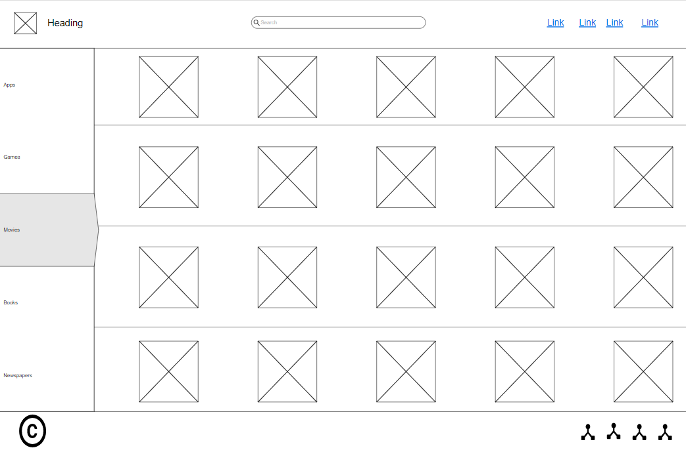
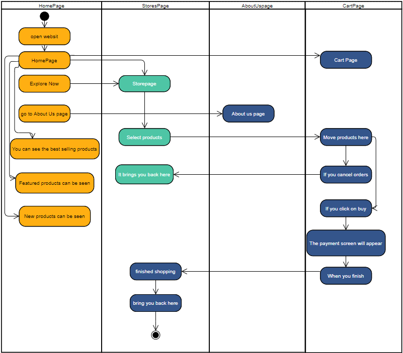

# Task 1

## Q1- 

# ( Hand Made App ) 

* This idea provides for the production of a platform/application for handmade makers in all its forms by displaying their products on the platform/application and ensuring that the made products reach the customers through dealing with a delivery company to make it easier for the product manufacturer to produce more product.

* The application will include many advantages for the product maker from He can monitor sales and views with the percentage of buyers per view.

| The Problems      | The Solution |
| ----------- | ----------- |
| The community does not have a platform that collects handicraft industrialists and provides them with services securely. | Providing a platform to display handcrafted products. |
| Difficulty delivering products to customers on time. | Delivering products at specific times. |
| They cannot safely deliver their products. | Contract with a delivery company to deliver the products. |
| Difficulty tracking the product to reach customers. | Providing a feature to track the products by the buyer. |
| Difficulty marketing and promoting manufactured products. | Enabling marketing and promotion in a safe and easy way. |
| The buyer has difficulty searching for the products he wants. | Providing the advantage of classification and sorting products according to the buyer's request. |
| Lack of trust between the seller and the buyer. | Provide evaluation feature to buyer and seller. |
| Difficulty knowing product prices. | To oblige the seller to determine and set the price of the product and all its details. |
| Difficulty knowing if a product is available or not. | The existence of a feature available or not available for the product. |
| Traditional payment methods. | There are multiple payment methods. |

***

## Q2-

### risk:-

1. Facing something I don't know how to solve.
2. Standing at something you need to pause to learn to complete the task.
3. The scope can be changed.
4. The user may have a problem using the website.
5. Poor time management.
6. Bad team contact.
7. Invalid code.
8. Inaccurate project estimates.

***

## Q3-

### List of requirements:-

1. Develop a project action plan.
2. Create a wireframe for all project pages.
3. Create html, css & javascript for all project pages.
4. The system must be able to store customer orders in LocalStorage.
5. The system must be able to show the products that the customer has added to the cart.
6. The system should be able to remove everything in the cart only when you click cancel.
7. The system should be able to give the user the final cost of the products automatically.
8. The system should allow the user to increase and decrease the number of the product he wants to buy.
9. The system must be able to display products in the cart.
10. Testing the project pages to make sure everything works.
11. Create a document to explain how to use the website.

### WireFrames:-

* homepage:

* Storespage:

* AboutUsPage:

* CartPage:

***

### Activity Diagram:-

***

### technique:-

* What is Waterfall?

**The Waterfall Model is followed in a sequential order, the project development team will only go on to the next phase of development or testing if the previous step has been successfully completed.**

* What is the Agile?

**Agile methodology is a strategy that aids in the software development process by allowing for continuous iteration of development and testing. This method helps consumers, developers, managers, and testers to communicate more effectively.**

| Difference between Agile and Waterfall Model:     |  |
| ----------- | ----------- |
| It takes a step-by-step method. | a way of designing in a progressive order. |
| The project development life cycle is divided into sprints. | There are several stages to the software development process. |
| its flexibility. | It has the potential to be extremely inflexible. |
| Agile may be thought of as a collection of several projects. | The development of software will be done as a single project. |
| After each sprint, the test plan is evaluated. | During the testing phase, the test strategy is rarely addressed. |
| The test team may easily participate in requirement changes. | Any change in requirements is tough for the test to begin. |

***

## In my project I will use Waterfall methodology because it has a lot of features which are:

### Advantages of Waterfall Model:

1. It's one of the simplest models to work with. Each phase has particular deliverables and a review procedure due to its nature.
2. Project completion in a shorter amount of time.
3. It works effectively for tiny projects with simple needs.
4. Both the process and the outcomes are extensively recorded.	
5. When it comes to managing dependencies, this project management technique comes in handy.
6. Method for reorganizing teams that is easily adaptable.

***

### Testing technique:-

**The testing technique I used in my project is Black Box Testing.**

## what is black box testing?

**Black Box Testing is a software testing approach that involves testing the functionality of software applications without knowing the internal code structure, implementation details, or internal pathways. Black Box Testing is a form of software testing that is entirely driven by software requirements and specifications and focuses on the input and output of software applications. Behavioral testing is another name for it.**

| Advantages of black box testing:     | 
| ----------- |
| Extremely effective. | 
| Customer satisfaction is achieved. |
| Nice revenue, good product. | 
| Quality  |
| Optimization of the business. | 
| Experience of the user. |

## More info at Stage 3

***

# References:-

[guru99](https://www.guru99.com/waterfall-vs-agile.html)

[forecast](https://www.forecast.app/faqs/what-is-the-difference-between-agile-and-waterfall)

[guru99](https://www.guru99.com/black-box-testing.html)

[elprocus](https://www.elprocus.com/what-are-testing-techniques-types-advantages-disadvantages/)

